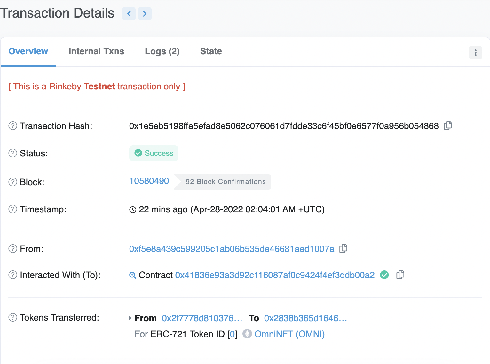

# LayerZero Cross-Chain NFT Transfer (Avax-Eth)

Deploy OmniNFT Contract to ETH (Rinkeby)\
https://rinkeby.etherscan.io/tx/0x53e1fd3fd97c3d904c8afd0f11d77aea738dd2d0127c661c202008759cca7ed7

Mint OmniNFT\
https://rinkeby.etherscan.io/tx/0x42e17cac2cda9c900c6a462f8326dff448e23c6920aa34e96f4aaa3b122d9c4d

Approve LayerZero Endpoint for NFT Transfer\
https://rinkeby.etherscan.io/tx/0xc71c26f0c0bd8b9c207f7e77f4cb585602445dd34ff13ec96a04376e03a663c8

Deploy Marketplace Contract to Avax (Fuji)\
https://testnet.snowtrace.io/tx/0xfc458b7d207eb57ebeda88344ffa97445577e3b4ac3bc9184a28bacbb1e97261

MarketPlace Send LayerZero Message to Change NFT Owner\
https://testnet.snowtrace.io/tx/0xf7c52e75d131384e1528c649d9b17cd7a716a232ceb31394e528a4174b7d50df

NFT Receive LayerZero Message and Change NFT Owner\
https://rinkeby.etherscan.io/tx/0x1e5eb5198ffa5efad8e5062c076061d7fdde33c6f45bf0e6577f0a956b054868
